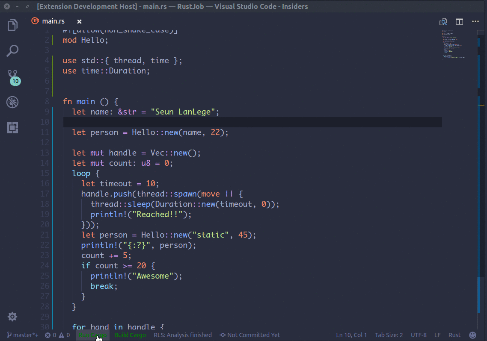

# VsCode Action Buttons

This allows you to define custom actions such as `run` or `build` and append them to a status bar button in vscode.

## Features

You can define a custom action to build a rust project like so.




## Installation and set up

 - [x]  Search for `VsCode Action Buttons` in the extensions store.

 - [x] After installing, type `ctrl + shift + p` and open up work space settings.

 - [x] Now you can define, your action buttons. Below is a sample.

 - [x] Now Reload.

 ```json
 	"run": {
		 "defaultColor": "#ff0034", // Can also use string color names.
		 "commands": [
			 {
				 "name": "Run Cargo",
				 "color": "green",
				 "command": "cargo run", // This is executed in the terminal.
			 },
			 {
				 "name": "Build Cargo",
				 "color": "green",
				 "command": "cargo build",
			 }
		 ]
	 }
 ```

 # Alternatively

 If you open an existing project and want to set up action buttons for that workspace.

 * Define the action buttons in your workspace settings.
 * Then, type `ctrl + shift + p`, search for `Refresh Action Buttons` and click on it.
 * You Should now see the action buttons on the status bar :).


## Release Notes

###v0.0.7
Added support for default Colors

### v0.0.6
Added support for reading actions from the scripts segment of package.json.

### v0.0.3
Better documentation.

### v0.0.1
  Initial Release
