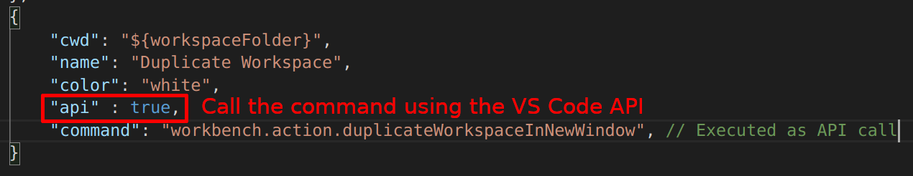

# VsCode Action Buttons

This allows you to define custom actions such as `run` or `build` and append them to a status bar button in vscode.

## NEW!

You can now execute Visual Studio API commands through action buttons!



## Features

You can define a custom action to build a rust project like so.


## Installation and set up

 - [x]  Search for `VsCode Action Buttons` in the extensions store.

 - [x] After installing, type `ctrl + shift + p` and open up work space settings.

 - [x] Now you can define, your action buttons. Below is a sample.

 - [x] Now Reload.

 ```json
 	"actionButtons": {
		 "defaultColor": "#ff0034", // Can also use string color names.
		 "loadNpmCommands":false, // Disables automatic generation of actions for npm commands.
		 "reloadButton":"♻️", // Custom reload button text or icon (default ↻). null value enables automatic reload on configuration change
		 "commands": [
			 {
				 "cwd": "/home/custom_folder", 	// Terminal initial folder ${workspaceFolder} and os user home as defaults
				 "name": "Run Cargo",
				 "color": "green",
				 "singleInstance": true,
				 "command": "cargo run ${file}", // This is executed in the terminal.
			 },
			 {
				 "name": "Build Cargo",
				 "color": "green",
				 "command": "cargo build ${file}",
			 }
		 ]
	 }
 ```

 # Alternatively

 If you open an existing project and want to set up action buttons for that workspace.

 * Define the action buttons in your workspace settings.
 * Then, click on `Refresh Action Buttons` in the status bar
 * You Should now see the action buttons on the status bar :).

# Config Options

## singleInstance: boolean default [false]
	Kills the running associated process and restarts it.
	
## Usage

 ```json
 	"actionButtons": {
		 "reloadButton": null,
		 "loadNpmCommands": false,
		 "commands": [
			 {
				 "name": "Run Cargo",
				 "singleInstance": true,
				 "color": "#af565c",
				 "command": "cargo run ${file}",
			 },
		 ]
	 }
 ```

## Release Notes

### v1.1.5
Added support for VSCode API calls
Added `api` option.

### v1.1.4
Added support for VSCode predefined variables as ${file}
Added `cwd` option.
Added `reloadButton` option.

### v1.1.3
Added `loadNpmCommands` option.

### v1.1.2


### v1.1.0
Added `Refresh Action Buttons` action button

### v1.0.0
Changed configuration name from `run` to `actionButton`
Better support for js projects

### v0.0.8
Added `singleInstance` option.

### v0.0.7
Added support for default Colors

### v0.0.6
Added support for reading actions from the scripts segment of package.json.

### v0.0.3
Better documentation.

### v0.0.1
  Initial Release
